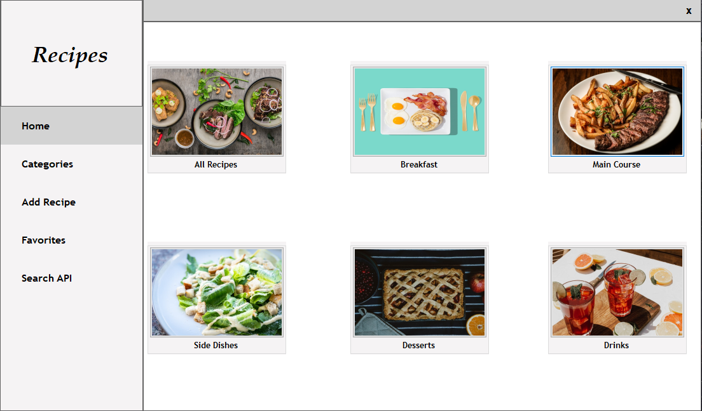
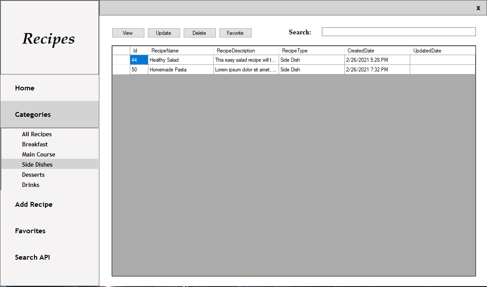

# Recipe Manager


## Description
Easy to use recipe manager to store food recipes that saves recipes to a database. This program uses the popular 
Dapper micro-ORM for SQL. Also it uses a small web api that can query Spoonacular's recipe database.

## Features

<br>
View all recipes saved on database


<br>
Sort each recipes by its category


<br>
View recipe details for ingredients and instructions


<br>
Add new recipes


<br>
Simple Search and view recipes from Spoonacular's api
<br>
###### Instructions
* Register on Spoonacular's website for an api key. 
* Create file name specialappsettings.config
```xml
<?xml version="1.0" encoding="utf-8" ?>
<appSettings>
  <add key="APIKey" value="YOUR KEY HERE" />
</appSettings>
```
* Add your api key to value
* Ignore file to prevent exposing key

#### Other Features
* Update a recipe
* Delete a recipe
* Search for a specific recipe
* Favorite a recipe
* Save recipe as a text file